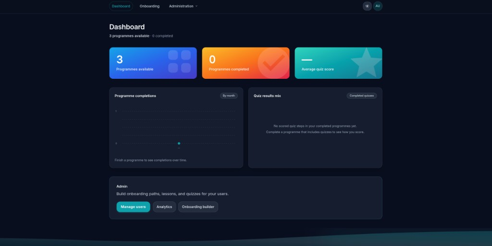
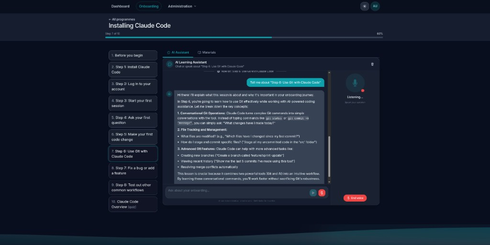

# Manifest





**Manifest** is a full-stack TypeScript application for **onboarding programmes**: learners step through published **lessons** (rich text) and **quizzes**, with saved progress, completion summaries, and a read-only review. **Administrators** manage users, departments, and programme content in a small admin area.

This repo is a **pnpm monorepo** (web SPA, REST API, shared package). Use it as a starting point or reference for a similar product—it is [MIT-licensed](LICENSE).

---

## Features

| Area | What it does |
|------|----------------|
| **Learners** | List programmes by department, open a player, complete steps in order, see quiz scoring where relevant, finish with a review of completed work. |
| **Admins** | CRUD onboarding programmes (steps, lesson HTML, quiz questions), publishing and department scoping, user list (roles / departments). |
| **Lessons** | [TipTap](https://tiptap.dev/) / ProseMirror editor in the admin builder; stored HTML is **sanitised** when shown in the player (structure, alignment, links, etc.). |
| **Auth** | JWT access token (client memory) + refresh token (**httpOnly** cookie). Optional **Microsoft Entra ID** SSO when tenant/client env vars are set. |
| **AI Assistant** | Floating chatbot available on every authenticated page, backed by a configurable AI provider (Ollama, OpenAI, Anthropic, or any OpenAI-compatible endpoint). Answers questions about published onboarding programmes. Administrators configure the provider, URL, and model via **Administration → AI Settings**. |

---

## Tech stack

- **Frontend:** React 18, Vite, Tailwind CSS, React Router, TipTap  
- **Backend:** Node, Express, Prisma, PostgreSQL  
- **Dev / deploy:** Docker Compose (dev and production Compose files), Turborepo at the root  

---

## Repository layout

| Path | Purpose |
|------|---------|
| `apps/web` | Vite + React SPA (dashboard, onboarding player, admin UI). |
| `apps/api` | Express API, Prisma schema & migrations, seed data. |
| `packages/shared` | Shared enums, types, and constants used by web and API. |

### Terminology

User-facing copy uses **programme** / **programmes** (Australian English). **URLs, JSON keys, and database fields** keep `program` / `programs` / `programId` so APIs stay stable—see code and `/api/.../programs` routes.

---

## Prerequisites

- **Node.js** 20+  
- **pnpm** 9 (`corepack enable` then `corepack prepare pnpm@9.15.4 --activate`)  
- **Docker** with Compose (optional but handy for Postgres + full stack)  

---

## Quick start

**Fastest path:** copy env templates, then use Docker Compose (see [Docker (development)](#docker-development)).

**Without Docker:** you need PostgreSQL reachable from your machine; set `DATABASE_URL` in `apps/api/.env`, run migrations and seed, start API and web (see [Local setup (without Docker)](#local-setup-without-docker)).

Default dev URLs: **web** `http://localhost:5173`, **API** `http://localhost:3001`.

> Seed accounts (`admin@example.com` / `Admin123!`, `user@example.com` / `User123!`) are **for local development only**. Use strong `JWT_*` secrets and real auth policy in any shared or production environment.

---

## Local setup (without Docker)

1. Copy environment templates:

   ```bash
   cp .env.example .env
   cp apps/api/.env.example apps/api/.env
   cp apps/web/.env.example apps/web/.env
   ```

2. Point **`DATABASE_URL`** in `apps/api/.env` (and any web vars) at PostgreSQL. When the API runs on the host, the DB host is usually `localhost`. The root `.env.example` may use `postgres` as the hostname—that matches the Docker Compose network, not bare-metal Postgres.

3. Install dependencies, build shared package, migrate, seed:

   ```bash
   pnpm install
   pnpm --filter @manifest/shared build
   cd apps/api && pnpm exec prisma migrate deploy && pnpm exec prisma db seed
   ```

4. Run API and web (separate terminals):

   ```bash
   pnpm --filter @manifest/api dev
   pnpm --filter @manifest/web dev
   ```

5. Open `http://localhost:5173` and sign in with the seeded users above.

---

## Docker (development)

**Prerequisites:** Docker with Compose. Copy `.env.example` to `.env` at the repo root.

Development Compose builds `DATABASE_URL` from `POSTGRES_USER`, `POSTGRES_PASSWORD`, and `POSTGRES_DB`, and supplies local-only JWT defaults unless you set `JWT_SECRET` / `JWT_REFRESH_SECRET`. Use strong secrets outside your own machine.

Start PostgreSQL + API (**3001**) + Vite (**5173**):

```bash
docker compose up --build
```

Detached:

```bash
docker compose up --build -d
```

- The API container runs `prisma migrate deploy` and `prisma db seed` on startup, then the dev server with hot reload.  
- Source is bind-mounted into the API and web containers; startup runs `pnpm install` (and shared build / `prisma generate` for the API) so `node_modules` works with anonymous volumes.  
- The web dev server **proxies `/api` to the API** (`VITE_DEV_PROXY_TARGET`, defaulting to `http://api:3001` in Compose). The SPA therefore talks to `http://localhost:5173/api/...`, which keeps **refresh `httpOnly` cookies same-origin**. Direct `fetch` to `localhost:3001` is cross-site on some browsers (e.g. Firefox) and those cookies may not attach—symptom: `POST /api/auth/refresh` **401** with **no `Cookie` header**.  
- After **dependency changes**, rebuild or restart so installs run again.  

### Migrations (API container)

```bash
make db-migrate NAME=describe_change
# or
NAME=describe_change pnpm db:migrate
```

Seed:

```bash
make db-seed
# or
pnpm db:seed
```

### Connect to Postgres from a desktop client

- Host: `localhost` · Port: `5432`  
- Database / user / password: values of `POSTGRES_DB`, `POSTGRES_USER`, `POSTGRES_PASSWORD` in `.env`.

---

## Docker (production)

Use the **standalone** production Compose file so dev bind mounts are not applied.

```bash
docker compose -f docker-compose.prod.yml --env-file .env up --build
```

- Static web via nginx on host port **8080** (container **80**).  
- API on **3001**.  
- Set **`WEB_ORIGIN`** to the browser origin of the SPA (CORS).  
- Set **`VITE_API_URL`** at **image build time** to the URL clients use for the API.  

> Do **not** merge `docker-compose.yml` with `docker-compose.prod.yml` for a clean production deploy—Compose merges volume definitions. Use `docker-compose.prod.yml` alone for production.

---

## AI Assistant

A floating chat widget is available on every authenticated page (bottom-right corner). It answers questions about published onboarding programmes by sending conversation context—including programme titles, lesson content, and quiz questions—to the configured AI provider.

### Supported providers

| Provider | Notes |
|----------|-------|
| **Ollama** | Self-hosted models. Requires a base URL (e.g. `http://localhost:11434`). API key optional. |
| **OpenAI** | GPT-4o, GPT-4 Turbo, etc. API key required. Base URL optional (defaults to `https://api.openai.com`). |
| **Anthropic** | Claude 3.5 Sonnet, Claude 3 Opus, etc. API key required. Base URL optional. |
| **OpenAI-compatible** | Any server that implements the OpenAI Chat Completions API (Groq, Azure OpenAI, LM Studio, Together AI, etc.). Requires a base URL. |

### Configuration

1. Sign in as an administrator and go to **Administration → AI Settings**.
2. Select a provider, enter the server URL (where required), and enter the API key.
3. Click **Refresh models** to load available models from the provider, select one, then **Save settings**.

### API key security

API keys are **never returned to the browser**. They are encrypted at rest using **AES-256-GCM** before being stored in the database. The key used for encryption is sourced from the `ENCRYPTION_KEY` environment variable.

Generate a key:

```bash
node -e "console.log(require('crypto').randomBytes(32).toString('hex'))"
```

Add it to `apps/api/.env`:

```
ENCRYPTION_KEY=<64 hex characters>
```

> **Required in production.** In development, the API falls back to an insecure all-zero key and prints a warning—this is intentional so local dev works without any configuration, but must never be used in a shared or production environment.

### Timeouts

Model responses can be slow. The chat endpoint allows up to **2 minutes** for a response before returning a timeout error. The model list endpoint times out after **10 seconds**.

---

## Microsoft Entra ID (optional SSO)

SSO is **disabled** if either `ENTRA_TENANT_ID` or `ENTRA_CLIENT_ID` is empty. When **both** are set, the API advertises SSO and the login page shows **Sign in with Microsoft** alongside email/password.

Put Entra variables in **`apps/api/.env`** (not only the web app), then **restart the API process**. The browser loads `GET /api/auth/sso/config` (via `VITE_API_URL`) to decide whether to show Microsoft sign-in.

**Docker Compose (dev):** `docker-compose.yml` loads the repo root `.env` for Postgres/JWT only. Entra values in **`apps/api/.env`** are picked up by the API because the project is bind-mounted and the dev server runs with cwd `apps/api`. Avoid defining `ENTRA_*` in Compose with `${VAR:-}` when the variable is only in `apps/api/.env` — that used to inject empty values and force `ssoEnabled: false`. For **production** Compose, put `ENTRA_*` in the same `.env` you pass to `--env-file` (typically the repo root file).

1. Register an app in Microsoft Entra ID.  
2. Under **Authentication**, add **Single-page application** redirect URIs, including **`http://localhost:5173/auth/callback`** (and production equivalents) **and** the app’s login URL used after sign-out, e.g. **`http://localhost:5173/login`**, so Microsoft can return users there after **Log out**.  
3. Enable **ID tokens**; the SPA posts the ID token to `POST /api/auth/sso/callback`.  
4. Set in **`apps/api/.env`**:  
   - `ENTRA_TENANT_ID` — directory (tenant) ID  
   - `ENTRA_CLIENT_ID` — application (client) ID  
   - `ENTRA_CLIENT_SECRET` — only if you use a confidential app **authorisation code** exchange instead of the default SPA ID-token flow.  
5. Align API **`WEB_ORIGIN`** (or CORS) with the SPA origin.

---

## Auth API (summary)

| Method | Path | Description |
|--------|------|-------------|
| GET | `/api/auth/session` | `{ hasRefreshCookie }` — whether the httpOnly refresh cookie is present (no JWT check). The SPA uses this to avoid calling `POST /api/auth/refresh` when there is no cookie (so you do not see a spurious 401 on first visit). |
| POST | `/api/auth/login` | Email/password; sets refresh cookie; returns `{ accessToken }`. |
| POST | `/api/auth/refresh` | Valid refresh cookie → `{ accessToken }`. **401** if the cookie is missing, invalid/expired, or the user no longer exists. |
| POST | `/api/auth/logout` | Clears refresh cookie. |
| GET | `/api/auth/sso/config` | `{ ssoEnabled, tenantId?, clientId? }`. |
| POST | `/api/auth/sso/callback` | Body: `{ idToken }` (SPA) or `{ code, redirectUri }` (confidential client). |

Other routes are protected with `Authorization: Bearer <accessToken>`. Examples: `GET /api/me`, `GET /api/admin/ping` (admin only).

---

## Root scripts

| Command | Description |
|---------|-------------|
| `pnpm dev` | Turborepo dev (local Node). |
| `pnpm build` | Turborepo production build. |
| `pnpm db:migrate` | Run `prisma migrate dev` inside the **API** Compose service (`NAME` required). |
| `pnpm db:seed` | Run Prisma seed inside the **API** Compose service. |

### Lockfile

For reproducible installs, run `pnpm install` locally, commit `pnpm-lock.yaml`, and consider `pnpm install --frozen-lockfile` in CI/Docker once the lockfile is trusted.

---

## License

[MIT](LICENSE)

---

## Support

- [Buy me a coffee](https://ko-fi.com/xykheel)
